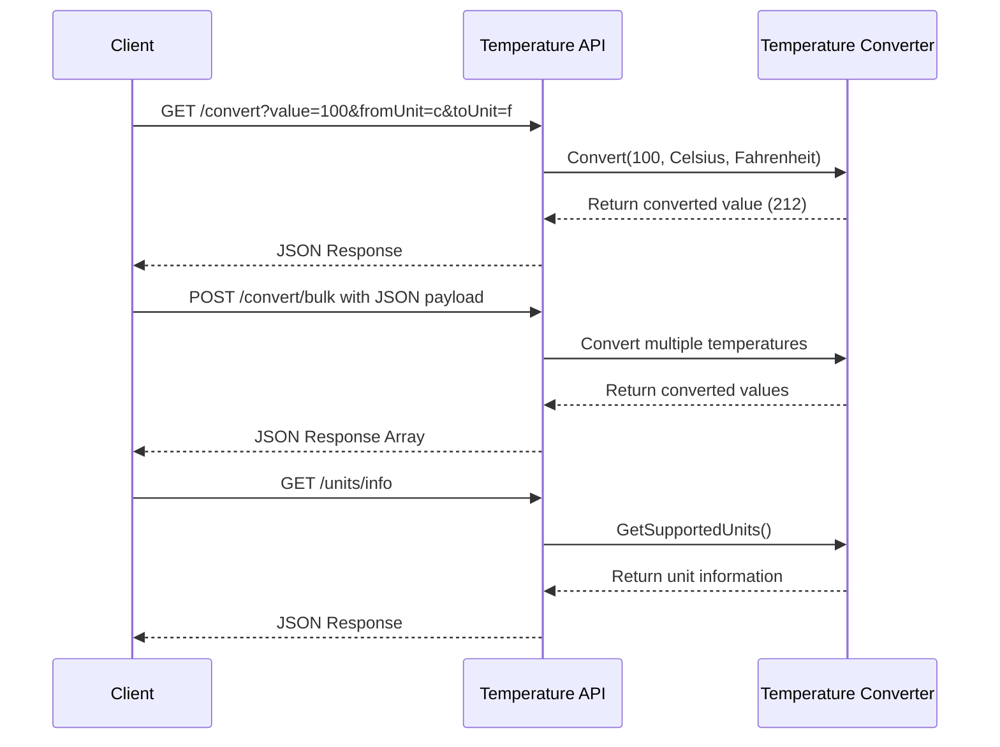

# Temperature Conversion Service

Converts temperatures between Celsius, Fahrenheit, and Kelvin. The service runs locally and accepts both single and bulk conversions.

## Before Running the Service

1. Install .NET 8.0 SDK from https://dotnet.microsoft.com/download/dotnet/8.0
2. Verify installation:
   ```bash
   dotnet --version   # Should show 8.0.x
   ```

## How to Run

1. Get the code and build:
   ```bash
   git clone https://github.com/alokbya/UnitService.git
   cd UnitService
   dotnet build
   ```

2. Start the service:
   ```bash
   cd src/UnitService.Api
   dotnet run
   ```

The service will run at:
- http://localhost:5278
- http://localhost:5278/swagger (API documentation)

## Making Requests

You can convert temperatures in three ways:

### 1. Convert a Single Temperature
Send GET request to `/api/v1/units/convert`

Python example:
```python
import requests

params = {
    'value': 100,    # temperature to convert
    'fromUnit': 'c', # c, f, or k
    'toUnit': 'f'    # c, f, or k
}
response = requests.get("http://localhost:5278/api/v1/units/convert", params=params)
result = response.json()
```

### 2. Convert Multiple Temperatures
Send POST request to `/api/v1/units/convert/bulk`

Python example:
```python
import requests

data = {
    "conversions": [
        {"value": 0, "fromUnit": "C", "toUnit": "F"},
        {"value": 100, "fromUnit": "C", "toUnit": "F"}
    ]
}

response = requests.post(
    "http://localhost:5278/api/v1/units/convert/bulk",
    json=data
)
results = response.json()
```

### 3. Get Valid Temperature Ranges
Send GET request to `/api/v1/units/info`

Python example:
```python
import requests
response = requests.get("http://localhost:5278/api/v1/units/info")
units = response.json()
```

## Responses You'll Get

### Single Conversion (Success)
```json
{
  "originalValue": 100,
  "originalUnit": "Celsius",
  "convertedValue": 212,
  "targetUnit": "Fahrenheit"
}
```

### Bulk Conversion (Success)
```json
[
  {
    "originalValue": 0,
    "originalUnit": "Celsius",
    "convertedValue": 32,
    "targetUnit": "Fahrenheit"
  }
]
```

### Unit Information (Success)
```json
[
  {
    "unit": "Celsius",
    "minimumValue": -273.15,
    "maximumValue": 1.7976931348623157E+308
  }
]
```

## Important Limits and Requirements

- Temperature ranges:
    - Celsius: -273.15 or higher
    - Fahrenheit: -459.67 or higher
    - Kelvin: 0 or higher
- Rate limit: 100 requests per minute
- Bulk conversions: Maximum 100 items per request
- Units can be specified as 'c'/'f'/'k' or 'celsius'/'fahrenheit'/'kelvin' (case doesn't matter)

## Sequence Diagram



## If Something Goes Wrong

1. Check that:
    - Service is running at http://localhost:5278
    - Temperature values are within allowed ranges
    - JSON format matches the examples
    - You're using GET for single conversions and POST for bulk

2. Common error responses:
    - 400: Invalid input (wrong unit or value)
    - 429: Too many requests
    - 500: Server error

## Need Help?

- Installation issues: Make sure you have the right .NET SDK version
- Port conflicts: Try changing the port in Properties/launchSettings.json
- Python issues: Make sure you have requests installed (`pip install requests`)
