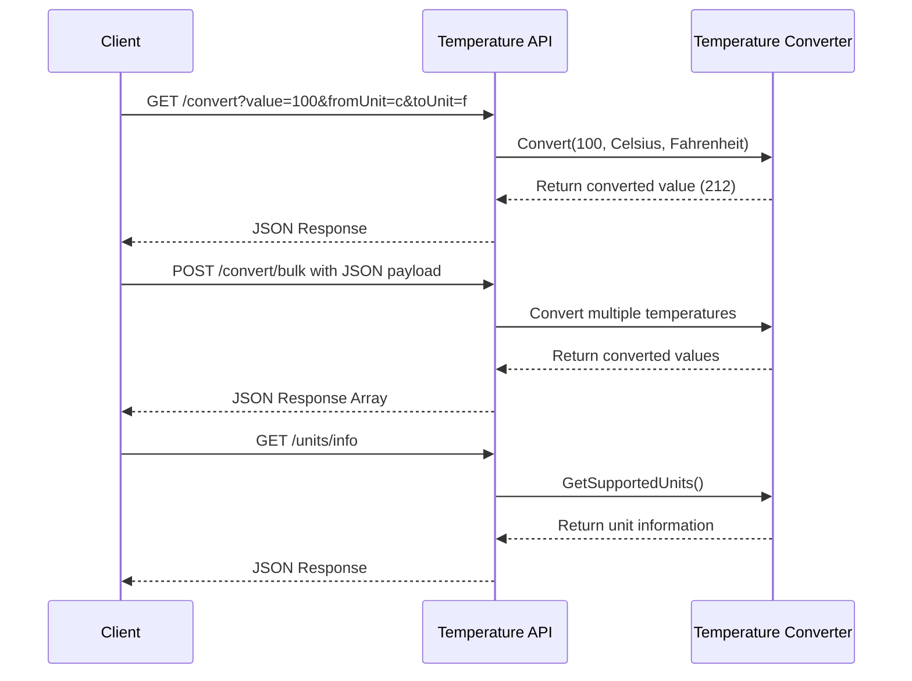

# Temperature Conversion Microservice

A REST API microservice that converts temperatures between different units (Celsius, Fahrenheit, and Kelvin).

## Development Setup

### Prerequisites

1. **Install .NET 8.0 SDK**
    - Download from: https://dotnet.microsoft.com/download/dotnet/8.0
    - Verify installation by running:
      ```bash
      dotnet --version
      # Should show 8.0.x
      ```

### Running the Service Locally

1. **Clone the repository**
   ```bash
   git clone https://github.com/alokbya/UnitService.git
   cd UnitService
   ```

2. **Build the solution**
   ```bash
   dotnet build
   ```

3. **Run the API**
   ```bash
   cd src/UnitService.Api
   dotnet run
   ```
   The service will start at:
    - http://localhost:5278
    - https://localhost:7278 (with HTTPS)

4. **View API Documentation**
    - Open Swagger UI at: http://localhost:5278/swagger
    - This provides interactive documentation and testing capability

### Environment-Specific Setup

#### Windows
- Install .NET SDK using the Windows installer
- Restart your terminal after installation

#### macOS
```bash
# Using Homebrew
brew install dotnet-sdk

# Or using official installer from Microsoft
# Download from dotnet.microsoft.com
```

#### Linux (Ubuntu/Debian)
```bash
# Add Microsoft package repository
wget https://packages.microsoft.com/config/ubuntu/$(lsb_release -rs)/packages-microsoft-prod.deb -O packages-microsoft-prod.deb
sudo dpkg -i packages-microsoft-prod.deb

# Install SDK
sudo apt-get update
sudo apt-get install -y dotnet-sdk-8.0
```

### Python Requirements
Python client requires the `requests` library:
```bash
pip install requests
```

## How to Request Data

The service provides three endpoints:

### 1. Single Conversion
```http
GET /api/v1/units/convert?value=100&fromUnit=c&toUnit=f
```

Parameters:
- `value`: The temperature value to convert
- `fromUnit`: The source unit (c/f/k or celsius/fahrenheit/kelvin)
- `toUnit`: The target unit (c/f/k or celsius/fahrenheit/kelvin)

Example using C#:
```csharp
using var client = new HttpClient();
var response = await client.GetAsync(
    "http://localhost:5278/api/v1/units/convert?value=100&fromUnit=c&toUnit=f");
```

Example using Python:
```python
import requests

params = {
    'value': 100,
    'fromUnit': 'c',
    'toUnit': 'f'
}
response = requests.get("http://localhost:5278/api/v1/units/convert", params=params)
result = response.json()
```

### 2. Bulk Conversion
```http
POST /api/v1/units/convert/bulk
Content-Type: application/json

{
  "conversions": [
    {
      "value": 0,
      "fromUnit": "C",
      "toUnit": "F"
    },
    {
      "value": 100,
      "fromUnit": "C",
      "toUnit": "F"
    }
  ]
}
```

Example using C#:
```csharp
var request = new
{
    conversions = new[]
    {
        new { value = 0, fromUnit = "C", toUnit = "F" },
        new { value = 100, fromUnit = "C", toUnit = "F" }
    }
};

var response = await client.PostAsync(
    "http://localhost:5278/api/v1/units/convert/bulk",
    new StringContent(
        JsonSerializer.Serialize(request),
        System.Text.Encoding.UTF8,
        "application/json"));
```

Example using Python:
```python
import requests

data = {
    "conversions": [
        {"value": 0, "fromUnit": "C", "toUnit": "F"},
        {"value": 100, "fromUnit": "C", "toUnit": "F"}
    ]
}

response = requests.post(
    "http://localhost:5278/api/v1/units/convert/bulk",
    json=data,
    headers={'Content-Type': 'application/json'}
)
results = response.json()
```

### 3. Unit Information
```http
GET /api/v1/units/info
```

Example using C#:
```csharp
var response = await client.GetAsync("http://localhost:5278/api/v1/units/info");
```

Example using Python:
```python
import requests

response = requests.get("http://localhost:5278/api/v1/units/info")
units = response.json()
```

## How to Receive Data

The service returns JSON responses:

### Single Conversion Response
```json
{
  "originalValue": 100,
  "originalUnit": "Celsius",
  "convertedValue": 212,
  "targetUnit": "Fahrenheit"
}
```

### Bulk Conversion Response
```json
[
  {
    "originalValue": 0,
    "originalUnit": "Celsius",
    "convertedValue": 32,
    "targetUnit": "Fahrenheit"
  },
  {
    "originalValue": 100,
    "originalUnit": "Celsius",
    "convertedValue": 212,
    "targetUnit": "Fahrenheit"
  }
]
```

### Unit Information Response
```json
[
  {
    "unit": "Celsius",
    "minimumValue": -273.15,
    "maximumValue": 1.7976931348623157E+308
  },
  {
    "unit": "Fahrenheit",
    "minimumValue": -459.67,
    "maximumValue": 1.7976931348623157E+308
  },
  {
    "unit": "Kelvin",
    "minimumValue": 0,
    "maximumValue": 1.7976931348623157E+308
  }
]
```

## Sequence Diagram



### Technical Requirements

1. **System Requirements**:
    - .NET 8.0 SDK
    - Python 3.7+ (for Python clients)
    - requests library (for Python clients)

2. **Rate Limits**:
    - 100 requests per minute
    - Bulk conversions limited to 100 items per request

3. **Validation**:
    - Temperature values must be within physical limits
    - Supported units: Celsius (c), Fahrenheit (f), Kelvin (k)
    - Case-insensitive unit specifications

### Troubleshooting Common Issues

1. **Service Won't Start**:
    - Verify .NET 8.0 SDK installation
    - Check port availability (5278)
    - Review console error messages

2. **Connection Issues**:
    - Verify service is running
    - Check URL and port
    - Ensure correct HTTP method (GET/POST)

3. **Invalid Responses**:
    - Verify JSON request format
    - Check unit specifications
    - Validate temperature ranges